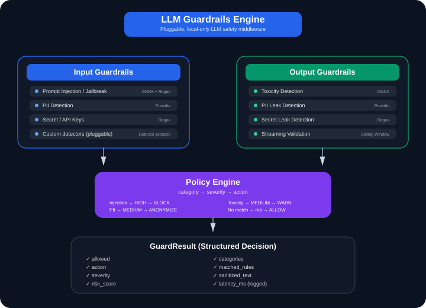
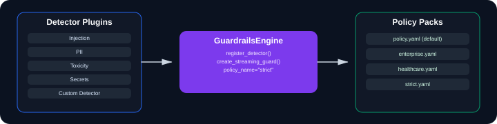

# LLM Guardrails / Safety Middleware

Pluggable input/output guardrails for LLM applications — prompt injection, jailbreak,
PII, secret/API-key leakage, and toxicity detection, with policy-driven actions
(block / anonymize / warn / allow). Runs entirely on local, free classifiers: no LLM API
call anywhere in the core pipeline, so the guardrail never depends on the kind of system
it's meant to constrain.

Full design, rationale, and the review history behind every decision here live in
[docs/buildplan.md](docs/buildplan.md).

## At a glance

**64/64 tests passing, `ruff` clean.**

| Capability | Status |
|---|---|
| Input guardrails (injection, jailbreak, PII, secrets) | ✅ |
| Output guardrails (toxicity, PII leak, secret leak) | ✅ |
| Policy engine (category → severity → action) | ✅ |
| Pluggable detector interface | ✅ |
| Versioned policy packs (strict / healthcare / enterprise) | ✅ |
| Streaming-aware validation | ✅ |
| FastAPI example | ✅ |
| Behavioral eval — input | ✅ 100% catch / 40% false-positive |
| Behavioral eval — output | ✅ 69% catch / 0% false-positive |
| Behavioral eval — cross-policy | ✅ |
| Latency benchmark (reproducible, hardware-reported) | ✅ |
| CI | ⏭️ deliberately skipped ([why](#whats-not-here-and-why)) |



<details>
<summary>Text version (if the diagram doesn't render)</summary>

```
Input Guardrails                          Output Guardrails
------------------                        -------------------
check_input(text)                         check_output(text)
  -> prompt injection detection             -> PII leak detection (Presidio)
  -> jailbreak pattern detection             -> toxicity detection (local classifier)
  -> PII in input (Presidio)                 -> secret/API-key leak detection (regex)
  -> secret/API-key detection (regex)

         \                                        /
          \                                      /
           v                                    v
              PolicyEngine (policy.yaml: category -> severity -> action)
                           |
                           v
              GuardResult(allowed, action, severity, risk_score,
                           sanitized_text, categories, matched_rules)
```

</details>

## Details

- **Phase 1** (input guardrails): prompt injection/jailbreak classifier (ONNX,
  `protectai/deberta-v3-base-prompt-injection-v2`) + regex fallback, PII detection
  (Presidio + spaCy `en_core_web_lg`), regex-based secret/API-key detection, combined
  into `check_input()`. Verified to run fully offline (no network after first model
  download). `injection_detector.category_for()` reports `jailbreak` (not
  `prompt_injection`) whenever only the regex fallback fires and the ML classifier
  itself doesn't — found while reviewing an architecture diagram, since `policy.yaml`
  had defined a `jailbreak` category from the start that no detector ever actually
  produced.
- **Phase 2** (output guardrails): toxicity classifier (ONNX, `unitary/toxic-bert`) +
  reused PII detector + reused secret detector, combined into `check_output()` — same
  `GuardResult` shape as `check_input()`.
- **Phase 2.5** (policy engine): `policy.yaml` maps `category -> severity -> action`,
  so the same severity can mean `block` for one category and `anonymize` for another.
  PII is anonymized via `presidio-anonymizer` instead of hard-blocked; a detected secret
  always hard-blocks (see "Secret/API-key detection" below for why). Conflicting
  categories on one input resolve via `BLOCK > ANONYMIZE > WARN > ALLOW`. Every non-ALLOW
  result logs a structured JSON explainability line (`action`, `severity`, `risk_score`,
  `categories`, `matched_rules`, `latency_ms`).
- **Phase 3** (red-team eval, input): 25 cases across prompt injection, jailbreak, PII,
  and clean/borderline controls — see [eval/results.md](eval/results.md). **Catch rate:
  100% (15/15 attacks correctly actioned). False-positive rate: 40% (4/10 benign
  cases flagged) — every single failure is individually root-caused in the results
  table**, not hidden: three are inherent limitations of the pretrained injection
  classifier's phrasing sensitivity, one is spaCy's NER tagging a fictional character
  name ("Romeo", "Juliet") as PERSON, same as it would a real name. **Latency
  (steady-state): mean 43.5ms, p95 191.3ms per `check_input()` call. Cold start
  (one-time model load per process): ~9s** — reported separately since it's not a
  per-request cost.
- **Red-team eval, output**: `eval/run_output_redteam.py`, 18 cases across toxic
  generation, subtle harassment, email/phone/API-key leaks, and clean replies — see
  [eval/output_results.md](eval/output_results.md). **Catch rate: 69.2% (9/13),
  false-positive rate: 0% (0/5), anonymization accuracy: 75%.** Two honest, unfixed
  failures: `unitary/toxic-bert` doesn't catch subtle/backhanded harassment (needs
  fine-tuning to fix, out of scope by design — see docs/buildplan.md's "what not to do");
  and one phone number only triggers `warn` instead of `anonymize` because Presidio's
  phone recognizer scores that particular format at ~0.4 confidence (the same
  calibration nuance documented back in Phase 1). Building this eval is what surfaced
  the secret-leak gap in the first place — see below.
- **Secret/API-key detection** (`src/guardrails/secret_detector.py`): regex-only,
  no model — covers AWS keys, GitHub tokens, OpenAI-style keys, Slack tokens, PEM private
  key blocks, and a generic `key/secret/token/password: <value>` assignment pattern.
  Added after the output red-team eval showed 0/3 API-key-leak cases were caught by the
  existing detectors — Presidio's built-in entity types don't cover secrets at all.
  Blocks at every severity in every policy pack (there's no meaningful "low-confidence"
  secret match; a regex either matches or it doesn't).
- **Phase 5** (streaming-aware validation): `StreamingGuard(window_size, stride)` runs
  the same detectors as `check_output()` on an overlapping sliding window instead of
  buffering the full response — see [demo/streaming_results.md](demo/streaming_results.md).
  Two boundary-straddling test cases were deliberately constructed; neither produced a
  miss with either overlapping or disjoint windowing, because both classifiers turned
  out to be robust to fragment-level input on natural language. That's reported as the
  honest empirical result, alongside the analytical case for why overlap still matters
  in principle (it structurally guarantees full coverage of any span, which disjoint
  chunking does not — provably relevant for exact-pattern entities like credit card
  numbers, just not exercised by this test set).
- **Phase 4** (partial, by design): `examples/fastapi_app.py` — a single `POST /chat`
  endpoint wrapping a fake LLM call in `check_input()`/`check_output()`, smoke-tested
  end-to-end (clean / injection / PII cases). **CI and the LangGraph demo wrapper were
  deliberately skipped** — see "What's not here" below.
- **Pluggable detector interface**: `Detector` is a `Protocol` (not an ABC) — any object
  with a `check(text) -> DetectionSignal` method can be registered on a
  `GuardrailsEngine` via `register_detector(my_detector, stage="input"|"output")`, no
  subclassing required. The built-ins are wrapped as plugins (`InjectionDetectorPlugin`,
  `PiiDetectorPlugin`, `ToxicityDetectorPlugin`, `SecretDetectorPlugin`) in
  `src/guardrails/builtin_detectors.py`, proving the interface with real detectors, not
  just a toy example. `check_input()`/`check_output()` in `middleware.py` are unaffected
  and remain the simple, zero-config entry point.
- **Versioned policy packs**: `policy.yaml` at the repo root stays the zero-config
  default; `policies/strict.yaml`, `policies/healthcare.yaml`, and
  `policies/enterprise.yaml` are named alternatives with genuinely different tradeoffs
  (e.g. `pii.low` is `warn` by default, `block` under `healthcare`/`strict`), selected
  via `get_policy_engine("healthcare")` or `GuardrailsEngine(policy_name="healthcare")`.
  The FastAPI demo exposes this directly — `POST /chat` with
  `{"message": "...", "policy": "healthcare"}` uses it.

  

- **Cross-policy behavioral eval**: `eval/run_policy_comparison.py` runs the same 25
  red-team cases through all four policy packs — see
  [eval/policy_comparison.md](eval/policy_comparison.md). Catch rate and
  false-positive rate stay flat across policies (expected — policies never change
  whether detection fires), so the report also measures **hard-block rate**, which
  actually differs: attacks resolve to a hard `block` 67% of the time under
  `default`/`enterprise` (PII gets anonymized, not blocked) vs. **100%** under
  `strict`/`healthcare`. The same split shows up on benign inputs — 30% vs. 40%
  hard-blocked — which is the real, measured cost of each policy's tradeoff, not just
  the tradeoff as designed in YAML.
- **Streaming shares the plugin registry**: `GuardrailsEngine.create_streaming_guard()`
  builds a `StreamingGuard` from the engine's own registered detectors and policy pack,
  so a custom detector registered via `register_detector(d, stage="output")` is picked
  up by the streaming path too. Constructing `StreamingGuard()` directly still works
  with the same built-in defaults as before.
- **Latency reproducibility**: `eval/run_latency.py` reports p50/p95/mean warm latency,
  cold start, and the hardware it ran on (stdlib-only, no new dependency) — so the
  numbers above can be checked against different hardware, not just taken on faith.

## What's not here (and why)

- **CI**: a from-scratch build wouldn't have anything behind it worth discussing in an
  interview (see docs/buildplan.md, Revision 3) — it's optional polish, not part of the
  resume-ready claim, and isn't claimed anywhere in this README or the resume lines.
- **LangGraph demo wrapper**: deferred — it wraps a separate project's real code and
  wasn't needed to reach a complete, tested state here.

## Known gaps (stated honestly, not hidden)

- **Subtle/backhanded harassment isn't caught by the toxicity classifier** (0/3 in the
  output red-team eval). `unitary/toxic-bert` is trained mostly on overt toxicity;
  catching subtler harassment would need fine-tuning a detector, which is explicitly out
  of scope for this project (see docs/buildplan.md). Documented, not hardcoded around.
- **One phone-number format only warns instead of anonymizing**, because Presidio's
  phone recognizer scores it at ~0.4 confidence — below the MEDIUM severity threshold
  that would trigger anonymization under the default policy. Same known calibration
  nuance as Phase 1, now visible on the output side too.

## Setup

```bash
python -m venv .venv
source .venv/Scripts/activate  # Windows Git Bash; use .venv\Scripts\activate on cmd
pip install -e ".[dev]"
python -m spacy download en_core_web_lg
```

## Running tests

```bash
pytest -q
```

`tests/test_readme_sync.py` fails if this README drifts from the code: the test count,
every file path mentioned, the case counts, and the headline numbers (catch/false-positive
rates, latency) must match the test suite and the committed `eval/*.md` results. If you
re-run an eval and its numbers change, that test tells you which README line to update.

**First run needs internet access.** The injection and toxicity classifiers
(`protectai/deberta-v3-base-prompt-injection-v2`, `unitary/toxic-bert`) are downloaded
from Hugging Face and converted to ONNX once, then cached locally (`.onnx_cache/` and the
Hugging Face cache) — expect a few minutes the first time. After that everything runs
fully offline. In an environment that blocks huggingface.co, the ~35 tests that load
those models will error out; the rest (policy engine, secret detector, PII anonymizer,
etc.) don't need them and pass regardless.

## Running the eval / demos

```bash
python eval/run_redteam.py              # writes eval/results.md (input)
python eval/run_output_redteam.py       # writes eval/output_results.md (output)
python eval/run_policy_comparison.py    # writes eval/policy_comparison.md
python eval/run_latency.py              # prints p50/p95/mean + hardware info
python demo/streaming_validation.py     # writes demo/streaming_results.md
uvicorn examples.fastapi_app:app --reload   # then POST to /chat
```
